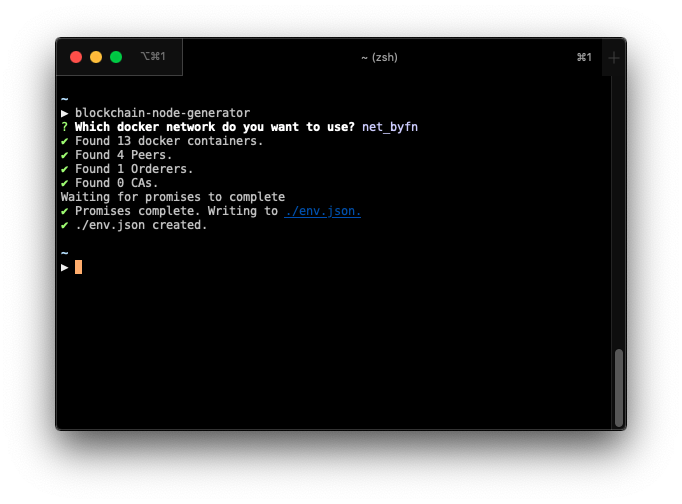

# IBM Blockchain Platform node file generator

blockchain-node-generator is an npm module that generates node files (.json) which are compatible with the IBM Blockchain Platform Visual Studio Code extension from local Docker networks.

## Install

```bash
npm install -g blockchain-node-generator
```

## Usage

The module can be used with cli parameters

```bash
blockchain-node-generator [--networkName=node_default]
```

Or with a cli interface



### Wallets

Ensure that you have wallets setup in the IBM Blockchain Platform Visual Studio Code extension with the name of each of the organisations in your network

## Import into the IBM Blockchain Platform extension for Visual Studio Code

Find more information [here](https://github.com/IBM-Blockchain/blockchain-vscode-extension#json-node-files)

This project is in no way affiliated with IBM
